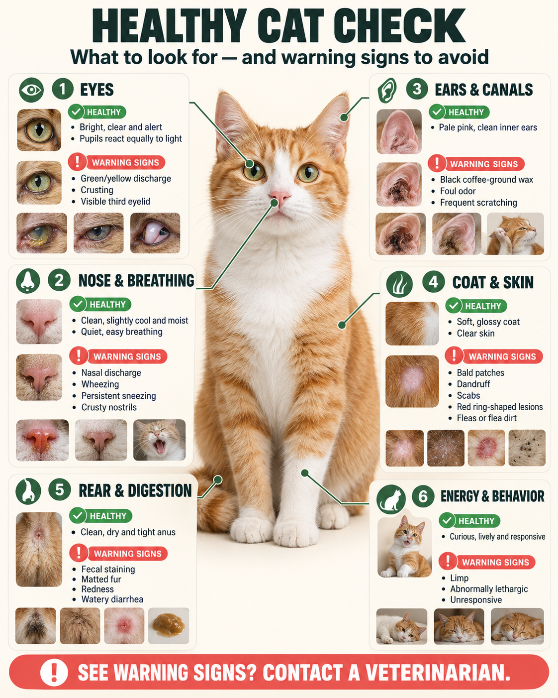
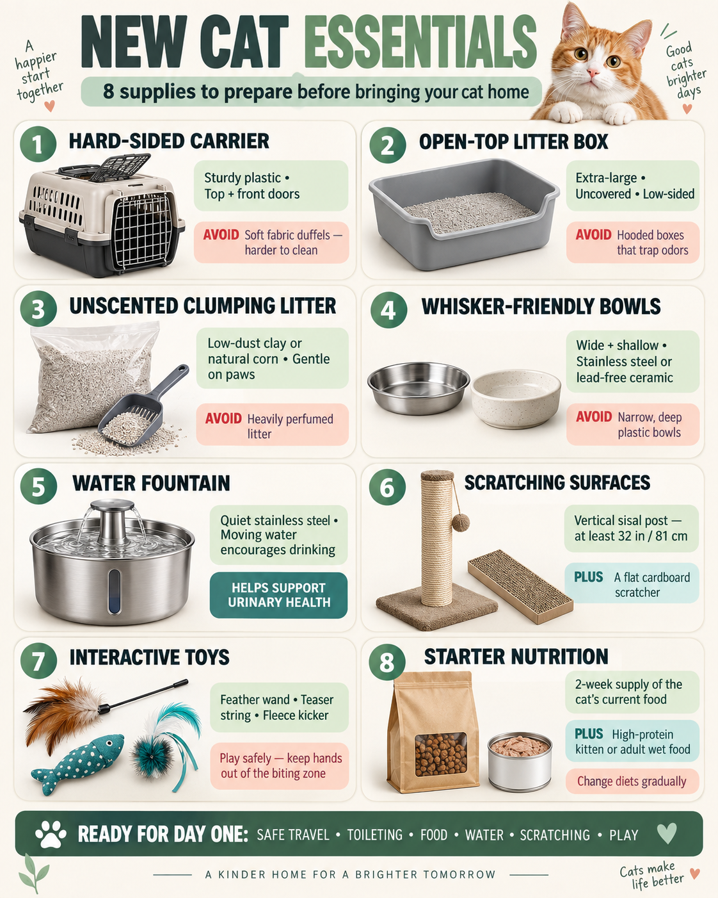
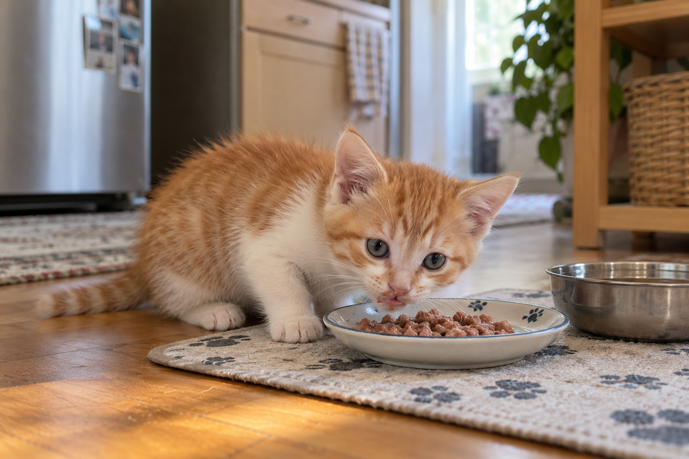
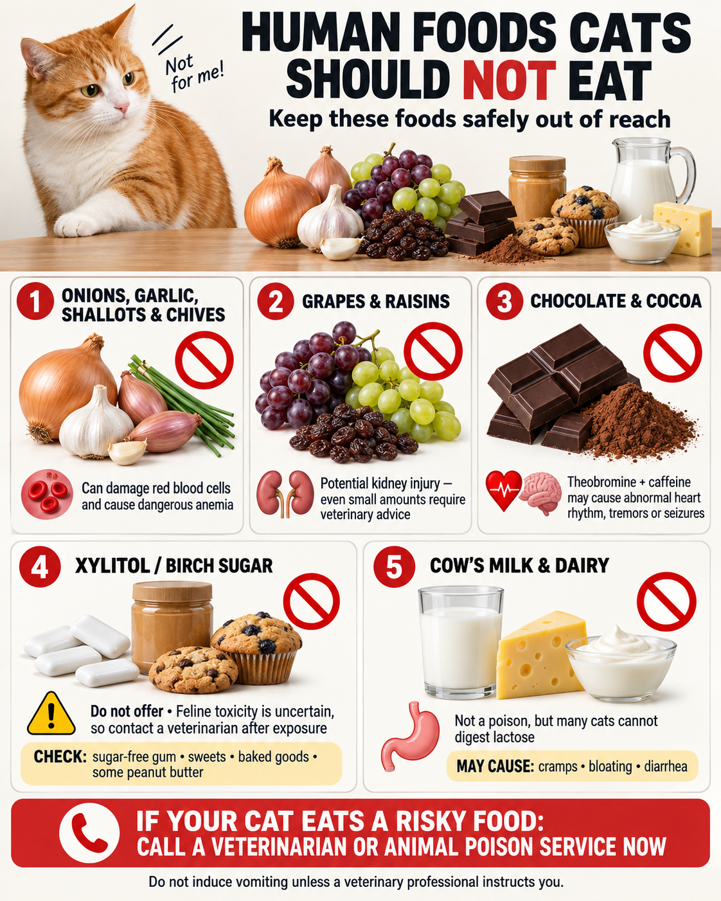
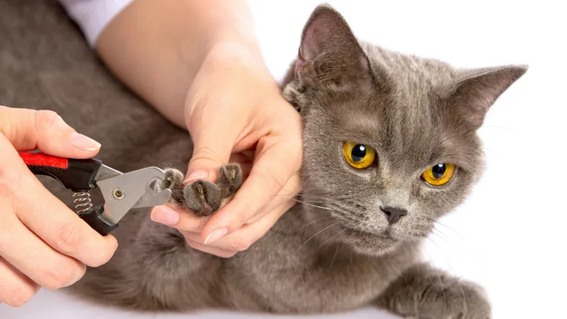

Welcoming a cat is deeply rewarding, but being a first time cat owner can quickly feel overwhelming. Between conflicting online advice and pricey gadget ads, it’s easy to second-guess every decision. 

In reality, cats don’t need luxury gear to thrive. They simply need the basics done right: a secure space, species-appropriate nutrition, patient socialization, and a guardian who understands their subtle body language.

Whether you are adopting a playful two-month-old kitten or welcoming an adult rescue cat, this comprehensive **first time cat owner guide** provides a budget-conscious, science-backed roadmap. From essential home-proofing and Day 1 arrival protocols to feeding transitions, medical milestones, and behavioral problem-solving, here is **everything you need for a cat** to live a long, vibrant, and contented life.

---

## Pre-Arrival Home Hazard Check: Cat-Proofing Your Space

Before picking up your cat, inspect your living space through the eyes of a curious, agile predator. Cats can squeeze through gaps as narrow as their skull and instinctively jump onto high surfaces, making preemptive hazard removal essential.

Taking a few hours to cat-proof your home prevents life-threatening accidents and costly emergency veterinary visits:

- **Window, Door & Outdoor Security:** Tailor your safety measures to your home layout:
  - *Apartments & High-Rise Condos:* Fit openable windows and balconies with reinforced wire mesh or safety netting (gaps under 2 inches / 5 cm) to prevent falls from upper floors ("high-rise syndrome") when chasing birds or insects.
  - *Houses & Single-Family Homes:* Focus on escape prevention. Check that ground-floor screen doors latch firmly, lock or restrict existing doggy doors, and watch entryways when coming home. If you want your cat to enjoy yard sights safely, use an enclosed catio rather than letting them roam outdoors.
- **Electrical Cord Management:** Bundle exposed phone chargers, television cords, and lamp cables inside protective split-wire conduit or cord covers. Teething kittens frequently gnaw on rubberized wires, risking severe electrical burns or pulmonary edema.
- **Household Chemicals and Toxins:** Lock away floor detergents, bleach, liquid potpourri, cosmetics, essential oils, and mosquito repellents containing pyrethroids, which are acutely toxic to feline livers. Never leave human medications out on countertops; common over-the-counter painkillers like acetaminophen (Tylenol) and ibuprofen are fatal to cats even in microscopic doses.
- **Houseplant Removal:** Cats naturally nibble on indoor vegetation. Remove all toxic plants before your cat arrives. Above all, **lilies (Lilium and Hemerocallis species) are 100% lethal to cats**; ingesting even a single grain of lily pollen, chewing a leaf, or licking vase water causes irreversible, fatal acute kidney failure within 36 to 72 hours. Other common indoor plants like pothos (devil's ivy), philodendron, and monstera contain insoluble calcium oxalate crystals that cause intense mouth burns, drooling, and airway swelling.

---

## How to Choose a Healthy Kitten or Cat: Physical Inspection Checklist

If you are visiting a shelter, foster home, or ethical rescue group, conduct a systematic physical assessment before finalizing your adoption. While many rescue cats have mild, treatable conditions like upper respiratory infections or fleas, recognizing health indicators helps you plan your initial veterinary budget.

Examine the cat in a quiet room and check these key physical markers:

- **Eyes:** Look for bright, clear, and alert eyes. Both pupils should react symmetrically to light. There should be zero green or yellow mucus discharge, crusting along the tear ducts, or protrusion of the third eyelid (nictitating membrane), which often indicates systemic illness or severe dehydration.
- **Nose and Breathing:** The nose leather should be clean, slightly cool, and moist. Watch for nasal discharge, audible wheezing, persistent sneezing, or crusty buildup around the nostrils, which are telltale symptoms of feline viral rhinotracheitis (feline herpesvirus) or calicivirus.
- **Ears and Ear Canals:** Healthy ears have pale pink, clean inner skin. Check deep inside the canal for black, coffee-ground-like wax, foul odors, or active scratching, which are classic signs of otodectic ear mites.
- **Coat and Skin Quality:** Run your hands gently through the cat's fur against the grain. The coat should feel soft and glossy without bald patches, dry flaking dandruff, scabs, or red ring-shaped fungal lesions (ringworm). Part the fur near the base of the tail and groins to check for active fleas or "flea dirt" (tiny black specks that turn red when smeared on a wet paper towel).
- **Anus and Digestion:** Inspect the perineal region beneath the tail. The anus should be clean, dry, and tight, with no fecal staining, matted fur, redness, or signs of active watery diarrhea, which could signal giardia, coccidia, or panleukopenia.
- **Demeanor and Energy:** A healthy kitten or adult cat displays lively curiosity and responsive body language. Avoid kittens that remain completely limp, abnormally lethargic, or unresponsive when approached.

---

## The Essential New Cat Checklist: Budget-Friendly Cat Must-Haves

One of the best **first time cat owner tips** is avoiding overpriced pet gadgets until you know your cat's specific preferences. Focus on functional, durable essentials that cover basic biological needs:

Review this practical **new cat checklist** of genuine **cat must haves**:

- **Hard-Sided Travel Carrier:** Choose a sturdy plastic carrier with both top-loading and front-loading doors. Soft fabric duffels are harder to clean if a frightened cat urinates or vomits en route.
- **Open-Top Litter Box:** Opt for an extra-large, uncovered plastic storage tote or low-sided litter pan. Many cats dislike enclosed, hooded litter boxes because they trap foul odors and block panoramic escape views.
- **Low-Dust Unscented Clumping Litter:** Cats have 200 million olfactory receptors. Avoid heavily perfumed, scented litters that irritate sensitive respiratory tracts. Standard clumping clay litter (such as Dr. Elsey's Ultra) or natural corn litter (such as World's Best Cat Litter) provides comfortable paw texture and superior clumping.
- **Whisker-Friendly Bowls:** Use wide, shallow stainless steel or lead-free ceramic saucers. Narrow, deep plastic bowls rub against sensitive facial whiskers, triggering "whisker fatigue," and porous plastic harbors bacteria that cause feline chin acne (black comedones).
- **Circulating Water Fountain:** Felines evolved as desert carnivores with a naturally low thirst drive. A quiet stainless steel fountain (like Catit or Petlibro) provides moving water that entices cats to drink, dramatically reducing the risk of feline lower urinary tract disease (FLUTD).
- **Sturdy Sisal Scratching Surfaces:** Provide both a tall vertical sisal post (at least 32 inches high so your cat can stretch fully) and a flat cardboard scratcher. Scratching sharpens claws, stretches shoulder muscles, and deposits scent from interdigital paw glands.
- **Interactive Wand Toys:** Feather wands, teaser strings, and fleece kickers allow you to bond and exercise your cat safely while keeping human hands out of the biting zone.
- **Starter Nutrition:** Purchase a 2-week supply of the exact food brand your cat ate at the shelter or foster home to avoid sudden dietary shock, alongside a carton of high-protein kitten or adult wet food.

---

## What to Do When Bringing a New Cat Home: The Day 1 Zero-Stress Protocol

The journey home and the first 24 hours determine how quickly your new pet acclimates. When **bringing a cat home for the first time**, remember that cats are strict territorial obligates; losing their previous environment makes them feel vulnerable to ambush.

### The Low-Stress Transit
Line the bottom of your carrier with an absorbent pee pad, topped with an old sweater carrying your scent. Before walking out to the car, drape a dark, lightweight cotton towel completely over the carrier. 

Darkness triggers a natural calming reflex by cutting off visual stimuli like passing traffic, glaring sun, and unfamiliar faces. Place the carrier on the floor of the vehicle behind the passenger seat, or fasten it securely with a seatbelt. Drive slowly, brake gently, and avoid playing loud podcasts or music.

### Setting Up the Sanctuary Room
When learning **how to introduce cat to new home** environments, never let a new cat roam free throughout your entire house on Day 1. The sheer volume of open space, unfamiliar echoes, and new smells causes severe sensory overload, prompting them to bolt behind heavy appliances or wedge themselves inside inaccessible sofa frames.

Instead, escort the carrier directly into a pre-prepared "sanctuary room." A guest bedroom, quiet home office, or clean laundry room with a solid closable door is ideal. 

Arrange the room with deliberate care:
- Place the litter box in one corner.
- Place food and water bowls at least 5 to 6 feet away from the litter area.
- Position a cozy bed or an open cardboard box lined with a fleece blanket nearby.
- Set up your scratching post near the doorway.

### The Gentle Arrival and Litter Introduction
Place the carrier on the floor, gently unlatch the door, and step back. Never tip the carrier upside down, bang on the plastic, or forcibly pull the cat out by their legs. Allow them to emerge autonomously over the next 1 to 2 hours. If they choose to remain curled inside the carrier until nightfall, respect their need for safety.

Once the cat steps out, gently scoop them up, place them directly inside the litter box, and use their front paw to gently scrape the litter twice. This simple tactile cue triggers their natural burying instinct, showing them exactly where their bathroom is.

Keep your new cat confined to this sanctuary room for **3 to 7 days**. During this initial quarantine, keep handling to a minimum. Avoid hosting curious friends, do not attempt to give the cat a bath, and do not administer vaccines or dewormers on Day 1. Let their cortisol levels stabilize in peace.

### The First Meal (4 to 6 Hours Post-Arrival)
Car travel and stress frequently cause transient nausea. Wait 4 to 6 hours after arrival before offering any food.

For kittens aged 2 to 3 months, soak 5 to 10 kibbles of high-protein kitten food (such as Royal Canin Mother & Babycat) in warm water (around 104°F / 40°C) or formulated pet goat milk for 10 minutes until it reaches an easily digestible porridge consistency. Offer small portions rather than a heaping bowl. If the cat hides and refuses to eat while you are present, place the food bowl near their hiding spot, dim the lights, and leave the room for an hour.

*Note for Multi-Cat Households: If you already have a resident cat at home, this sanctuary room quarantine is non-negotiable. It keeps both pets physically separated while you begin scent swapping. For a comprehensive, step-by-step introduction protocol, read our companion guide on [How to Introduce Cats to Each Other](/blog/how-to-introduce-cats-to-each-other-guide).*

---

## The First 30 Days to Month 8: Medical & Care Timeline

A responsible **first time cat owner guide** must emphasize preventative veterinary care. Staggering clinic visits, parasite treatments, and vaccinations ensures optimal immune protection without overwhelming young kittens.

### Comprehensive Feline Care & Medical Milestones

| Timeline | Milestone Focus | Veterinary Care & Procedures | Home Care & Daily Routine Protocols |
| :--- | :--- | :--- | :--- |
| **Week 1 (Days 1–7)** | Acclimation & Quarantine | Baseline health observation; monitor appetite, water intake, stool consistency, and sneezing | Sanctuary room confinement; feed original diet; zero baths, zero vaccinations, zero house-wide roaming |
| **Week 2 (Days 8–14)** | Trust Building & Initial Wellness Exam | Comprehensive veterinary exam: weight, ear swab (ear mites), fecal flotation test (intestinal worms), oral check | Begin hand-feeding small treats; gentle chin and cheek petting; speak in soothing tones |
| **Weeks 3–4 (Days 15–28)** | Parasite Eradication & Schedule | Administer broad-spectrum deworming (e.g., Revolution Plus topical / Drontal oral); separate from vaccines by 3 days | Transition to scheduled feedings (2–3 meals/day for adults; 4 meals/day for kittens); establish daily brushing |
| **Month 2 (Weeks 8–10)** | Core Vaccine Dose 1 | First FVRCP core shot (feline viral rhinotracheitis, calicivirus, panleukopenia) once body weight reaches ≥1.0 kg | Monitor for mild post-shot lethargy or slight fever for 24 hours; maintain strict indoor confinement |
| **Month 3 (Weeks 12–14)** | Core Vaccine Dose 2 + Rabies | Second FVRCP booster dose + Rabies vaccination (per local statutory guidelines) | Introduce gentle paw touching and nail clipper desensitization; expand territory exploration under supervision |
| **Month 4 (Weeks 16–18)** | Core Vaccine Dose 3 | Third and final FVRCP booster dose; core viral immunization fully established | First optional water bath if heavily soiled; introduce daily enzymatic tooth brushing |
| **Months 5–8** | Spay / Neuter Surgery | Pre-anesthetic blood panel; spay (females at 5–7 months before first heat, weight ≥2.5 kg) or neuter (males at 6–8 months) | Fast food for 8 hours and water for 4 hours pre-op; wear Elizabethan collar for 7–10 days post-op; restrict jumping |

---

## Feeding Principles & Dietary Transitions

Nutritional errors during the first six months can cause chronic enteritis, stunted bone growth, or obesity. Understanding feline physiology helps you make smart feeding choices.

### Kitten vs. Adult Feeding Schedules
Cats are obligate carnivores with short, acidic digestive tracts designed for frequent, protein-dense meals:
- **2 to 3 Months (Weaning Kittens):** Feed 4 meals per day (typically 7:00 AM, 12:00 PM, 6:00 PM, and 10:00 PM) using softened kitten kibble mixed with warm water or pet goat milk.
- **4 to 6 Months (Active Growth):** Feed 3 scheduled meals per day, transitioning to crunchy dry kibble alongside canned wet food.
- **6 Months and Older (Young Adults):** Feed 2 to 3 measured meals per day. Avoid leaving overflowing bowls of dry kibble out 24/7 ("free-feeding"), which disrupts natural satiety cues and leads to early feline obesity.

### How to Select Quality Cat Food
When shopping for commercial cat food, ignore fancy marketing buzzwords and examine the guaranteed analysis and ingredient list:
- **Real Animal Meat in Top 3 Ingredients:** Look for named protein sources such as deboned chicken, turkey, salmon, or duck. Avoid ambiguous ingredients like "animal by-product meal" or generic "meat derivatives."
- **Guaranteed Protein and Fat Levels:** Growing kittens require a minimum of 30% to 35% crude protein and at least 12% to 18% crude fat on a dry matter basis to fuel metabolic development.
- **Grain-Free and Low-Carbohydrate Content:** Felines produce minimal salivary and pancreatic amylase. Foods packed with cheap fillers like corn gluten, wheat flour, and soy can trigger digestive allergies and loose stools.
- **Essential Micronutrients:** Verify that the package carries an official AAFCO (Association of American Feed Control Officials) statement confirming it is nutritionally complete and balanced. Ensure adequate supplementation of **taurine**, an essential amino acid that cats cannot synthesize; taurine deficiency causes irreversible dilated cardiomyopathy (heart failure) and retinal blindness.

### The 7-Day Food Transition Schedule
Never switch your cat's diet overnight. A sudden change disrupts delicate intestinal flora, resulting in osmotic diarrhea, vomiting, and secondary food aversion. Always use the veterinary 7-day transition method:

| Transition Phase | Old Food Percentage | New Food Percentage | Daily Observation Goal |
| :--- | :--- | :--- | :--- |
| **Days 1–2** | 75% | 25% | Monitor stool shape; look for formed, firm brown logs |
| **Days 3–4** | 50% | 50% | Check for soft stools or flatulence |
| **Days 5–6** | 25% | 75% | Verify appetite remains vigorous |
| **Day 7 Onward** | 0% | 100% | Full dietary transition successfully completed |

### Hydration and Lower Urinary Tract Health
In the wild, felines obtain up to 70% of their daily moisture directly from prey. Domestic cats fed exclusively on dry kibble (which contains only 10% moisture) frequently live in a state of chronic mild dehydration. 

In male cats, concentrated urine allows struvite or calcium oxalate crystals to precipitate, forming urethral plugs. Urethral obstruction (urinary blockage) is a rapid, fatal veterinary emergency. To prevent this, incorporate canned wet food into their daily diet, position 2 to 3 fresh water bowls throughout your home, and clean your water fountain weekly.

### The Toxic Human Food Blacklist
Keep the following human foods strictly away from your cat:
- **Onions, Garlic, Shallots, and Chives:** Contain thiosulfate and allyl propyl disulfide, which destroy feline red blood cell membranes, causing life-threatening hemolytic anemia.
- **Grapes and Raisins:** Ingesting even small quantities can trigger sudden, irreversible acute kidney failure.
- **Chocolate and Cocoa Powder:** Contain theobromine and caffeine, which stimulate the central nervous system, leading to dangerous arrhythmias, muscle tremors, and seizures.
- **Xylitol (Birch Sugar):** Commonly found in sugar-free gum, peanut butter, and baked sweets; triggers rapid, catastrophic hypoglycemia and acute liver failure.
- **Cow's Milk and Dairy Products:** Weaned kittens lose the lactase enzyme required to digest lactose. Giving a cat cow's milk causes acute abdominal cramps, bloating, and explosive diarrhea.

---

## Decoding Cat Body Language, Touch Etiquette & Trust Building

Cats are subtle communicators. Understanding their physical cues prevents unintentional scratch or bite wounds and accelerates mutual affection.

### Feline Body Language: Contentment vs. Overstimulation
Always read a cat's posture as a whole rather than relying on a single signal:

- **Tail Up with a Gentle Curve:** The upright "question mark" tail is the universal feline greeting, signaling relaxed curiosity, approachability, and confidence.
- **The "Cat Kiss" (Slow Blink):** When a cat makes soft eye contact, slowly closes their eyelids, and opens them again, they are demonstrating profound trust. You can return the affection by slowly blinking back and softly averting your gaze.
- **Rhythmic Purring:** A purring cat resting with paws tucked beneath their chest is thoroughly relaxed. However, note that cats occasionally purr while injured or anxious as an internal self-soothing mechanism.
- **Airplane Ears (Flattened Outward and Back):** Ears swiveled flat like airplane wings indicate rising fear, defensive arousal, or irritation. Immediately step back and give the cat space.
- **Swishing or Thumping Tail:** A wagging tail does not mean happiness in cats. A tail tip twitching rapidly or slapping against the carpet signals sensory overload and impending defensive strikes.

### Safe Petting Zones and the Forbidden Belly Trap
First-time cat owners often make the mistake of petting a cat like a dog. Felines have concentrated scent glands across their head and face, making these areas the primary target for pleasurable touch.

Approach with the "index finger test": extend a relaxed finger at nose level from a few inches away. Allow the cat to step forward and sniff. If they rub their cheek, chin, or temple against your knuckle, they are depositing facial pheromones and granting permission to pet.

Focus your touch on these optimal zones:
- The base of the chin and along the lower jawline
- The cheeks and scent glands beside the whiskers
- The crown of the head between and behind the ears
- Along the spine down to the base of the tail

**The Belly Trap:** When a relaxed cat rolls onto their back and exposes their soft underside, human instinct is to rub the belly. In the feline lexicon, presenting the abdomen is an ultimate display of safety and trust—**not an invitation for touch**. Touching a cat's vulnerable belly almost instantly triggers an instinctive predatory grab-and-kick reflex with front paws, rear claws, and teeth. Avoid touching the belly, hind legs, tail, and paws until you have built months of deep rapport.

### Standard Supportive Two-Hand Holding Technique
Proper handling protects both your skin and your cat's delicate spine:
1. Place one open hand securely beneath the cat's ribcage, supporting their front chest and front legs.
2. Simultaneously cup your other hand and forearm under their rear hindquarters and back legs, fully bearing their body weight.
3. Bring the cat close against your chest so they feel firmly supported. Never lift an adult cat by the scruff of their neck (scruffing causes pain, panic, and muscle damage in adult felines) and never allow their hind legs to dangle suspended in mid-air.

### Early Socialization (2 to 4 Months)
The feline socialization window peaks between 8 and 16 weeks of age. Spend 5 minutes every day gently massaging your kitten's paw pads, lightly tapping their claws, checking inside their ears, and rubbing their outer gums. Desensitizing your kitten to tactile handling during this golden window makes future nail clipping, ear cleaning, and teeth brushing effortless.

---

## Preventing Common Behavioral Headaches

Most behavioral complaints from first-time cat parents are natural feline instincts redirected into frustrating household habits. Correcting them early preserves your furniture and your peace of mind.

### 1. Hand and Ankle Biting
- **The Root Cause:** Wiggling fingers, wrestling bare hands with kittens, or moving feet beneath bedsheets teaches young felines that human flesh is acceptable prey.
- **The Solution:** Never use your hands as toys. Always direct predatory play toward teaser wands, kickers, and balls. If your cat pounces on your hand, immediately freeze—do not jerk your hand away, which mimics escaping prey—and emit a sharp, high-pitched "Ouch!" Then turn your back and deliver a strict 60-second "cold shoulder" by withdrawing all attention.

### 2. Inappropriate Elimination (Litter Box Avoidance)
- **The Root Cause:** Felines avoid litter boxes if the box is dirty, if there are not enough boxes, or if they are suffering from medical issues like urinary tract infections (UTIs) or bladder crystals.
- **The Solution:** Adhere strictly to the **N+1 Litter Box Rule**: provide one litter box per cat, plus one extra (1 cat = 2 litter boxes). Place boxes in separate rooms on different floors, never side-by-side. Scoop waste twice daily, maintain a 2 to 3-inch (5–8 cm) litter depth, and wash the box thoroughly every 2 to 3 weeks with hot water and mild unscented soap. If an adult cat suddenly urinates outside the box, consult your veterinarian immediately to rule out a urinary blockage.

### 3. Midnight Zoomies and Night Vocalizations
- **The Root Cause:** Felines are crepuscular, meaning their natural activity peaks at dusk and dawn. Young kittens left alone during the day accumulate pent-up energy that erupts at 3:00 AM.
- **The Solution:** Establish an evening routine aligned with natural feline circadian rhythms: **Hunt, Catch, Kill, Eat, Groom, Sleep**. Engage your cat in 15 to 20 minutes of intense, panting wand play right before your own bedtime, immediately followed by a small, protein-rich meal. A fed and exhausted cat will groom themselves and sleep peacefully through the night.

---

## Daily Grooming, Dental Care & Hygiene Protocols

Proper preventative grooming keeps shedding under control, prevents hairballs, and prevents painful dental disease down the road.

Maintain your cat's health with these regular grooming routines:

- **Coat Brushing and Hairball Management:** Brush short-haired cats every 2 to 3 days using a stainless steel slicker brush or silicone grooming glove; long-haired breeds (such as Persians or Maine Coons) require daily combing to prevent painful pelt mats. Regular brushing captures loose undercoat fur before your cat ingests it during self-grooming. To help pass unavoidable hairballs safely, grow fresh cat grass (wheatgrass) at home or provide a small ribbon of malt-based hairball paste weekly.
- **Nail Trimming Every 2 to 3 Weeks:** Use dedicated pet claw trimmers with a semi-circular blade notch. Gently press the center of the paw pad between your thumb and index finger to extend the claw. **Only clip the transparent hook at the very tip**; stay at least 2 millimeters away from the pink, triangular core (the quick), which contains blood vessels and nerve endings. Keep a jar of styptic powder (such as Kwik Stop) nearby to quickly stem bleeding if you accidentally clip too close.
- **Ear Cleaning (1 to 2 Times Monthly):** Squeeze a few drops of specialized veterinary ear cleaning solution into the ear canal, gently massage the fleshy base of the ear for 30 seconds until you hear a squishing sound, and step back to let your cat shake their head vigorously. Wipe away loosened surface wax using a soft cotton pad. **Never insert cotton swabs (Q-tips) into a cat's ear canal**, as this can rupture the delicate tympanic membrane or pack wax deeper inside.
- **Enzymatic Tooth Brushing:** Over 70% of cats develop periodontal disease by age three. Daily brushing is the gold standard, but brushing 2 to 3 times per week provides significant protection. Use a soft silicone finger brush paired with poultry- or malt-flavored **enzymatic pet toothpaste**. Never use human toothpaste, which contains foaming detergents and toxic artificial sweeteners like xylitol.
- **Bathing Realities:** Healthy cats spend 30% to 50% of their waking hours grooming themselves. Unless your cat falls into something sticky, develops severe diarrhea, or gets covered in grease, healthy indoor cats rarely require water baths. Bathing an unacclimated cat causes intense stress and strips protective natural oils from their skin. If their coat gets dusty, wipe them down with unscented, hypoallergenic pet grooming wipes.

---

## Recommended Trusted Brands for Beginners

Investing in clinically tested pet products protects your cat's health and provides reliable long-term value. Here is a curated selection of globally trusted veterinary and premium brands:

| Brand & Product Line | Category | Ideal Usage | Key Features & Veterinary Endorsements |
| :--- | :--- | :--- | :--- |
| **Royal Canin** (Mother & Babycat / Kitten) | Complete Nutrition | Kittens aged 1–12 months & nursing mothers | Highly digestible L.I.P. proteins, targeted immune antioxidants, soft rehydratable kibble; global clinical benchmark |
| **Hill's Science Diet** (Kitten / Indoor Adult) | Clinical Nutrition | Daily kitten development & lifelong urinary wellness | Precise nutritional balancing backed by animal nutritionists, controlled mineral ratios to prevent urinary stones |
| **Purina Pro Plan** (High Protein Kitten) | Premium Everyday Diet | High-energy growing kittens on a practical budget | Real poultry as #1 ingredient, guaranteed live probiotics for immune and gut health, high value-to-cost ratio |
| **Orijen & Acana** (Cat & Kitten / First Feast) | Biologically Appropriate | Pet owners seeking whole-prey, grain-free nutrition | 85–90% quality animal ingredients, rich fresh meat inclusions, zero cheap corn or soy fillers |
| **Tiki Cat** (After Dark Whole Prey Canned Food) | High-Moisture Wet Food | Hydration enrichment & finicky eaters | Real shredded organ meats in rich savory broth, zero carrageenan, ideal moisture support for kidneys and urinary tract |
| **Revolution Plus** (Zoetis - Topical Treatment) | Comprehensive Parasite Control | Monthly prevention against fleas, ticks, ear mites, and heartworms | Fast-acting 6-in-1 topical protection; prescription veterinary standard for kittens over 8 weeks and 2.8 lbs |
| **Drontal / Milbemax** (Elanco - Oral Tablets) | Internal Dewormer | Targeted treatment for roundworms, hookworms, and tapeworms | Broad-spectrum oral deworming tablet, clinical standard for newly adopted rescue animals |
| **Dr. Elsey's Ultra Cat Litter** | Hypoallergenic Clumping Litter | Odor control and multi-box setups | 99.9% dust-free, non-tracking clay granules, zero irritating artificial perfumes |
| **Petlibro / Catit PIXI** | Stainless Steel Water Fountain | Automatic 24/7 hydration stations | Hygienic stainless steel top prevents chin acne, continuous quiet circulation stimulates frequent drinking |

---

## Frequently Asked Questions (FAQ)

### What should I do during the first 24 hours of bringing a new cat home?
During the first 24 hours, place your cat directly into their sanctuary room inside the carrier, open the gate, and let them emerge at their own pace without forced interaction. Introduce them to their litter box, keep noise levels low, and wait 4 to 6 hours before offering a small meal of warmed wet food or softened kibble. Keep the room door closed to prevent sensory overload.

### How many litter boxes do I need for one cat?
For a single cat, you need at least two litter boxes according to the veterinary N+1 rule (number of cats plus one). Place these two boxes in distinct rooms rather than side-by-side. Having two boxes ensures your cat always has a clean bathroom available and prevents stress-induced house-soiling.

### When should I give my new kitten their first bath?
Healthy kittens should not be given water baths until they are at least 4 months old and have completed their full series of core vaccinations. Bathing a young kitten strips natural protective oils, induces severe temperature drops, and causes intense stress. If a young kitten gets dirty, gently clean them using a warm, damp washcloth or specialized hypoallergenic pet wipes.

### Why is my new cat hiding under the bed and refusing to eat?
Hiding and temporary loss of appetite are completely normal survival responses when a cat enters unfamiliar territory. In an unknown environment, cats feel vulnerable to predators. Give them time: leave fresh water and food near their hiding spot, dim the lights, maintain a predictable routine, and avoid trying to drag them out. Most cats begin exploring and eating quietly during the night.

### How do I stop my kitten from biting my fingers and toes?
To stop a kitten from biting human hands, completely eliminate bare-hand play. Always use interactive teaser wands and kickers so the cat associates toys—not fingers—with hunting. If your kitten bites your hand, immediately freeze, make a high-pitched yelping sound, and completely withdraw all attention for 60 seconds to teach bite inhibition through natural consequence.

---

<!-- JSON-LD FAQPage 结构化数据（爬虫可直接抓取） -->

